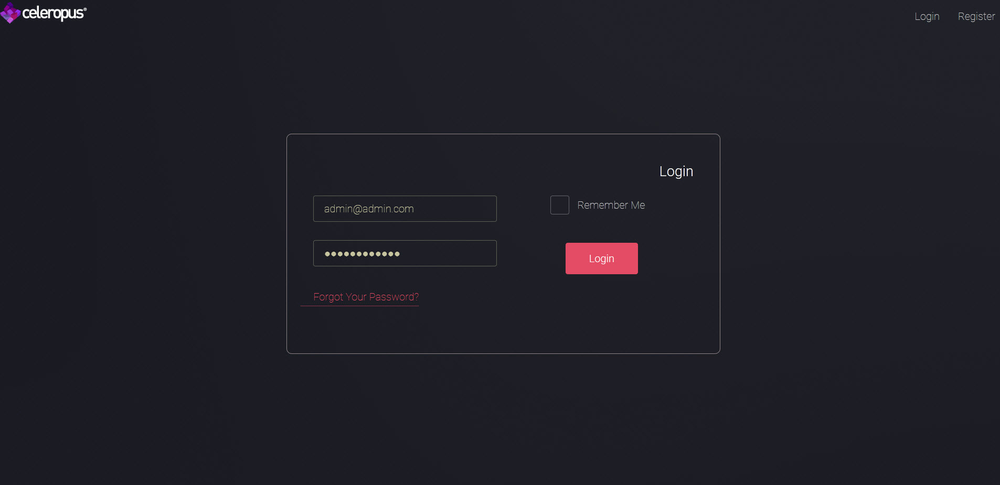
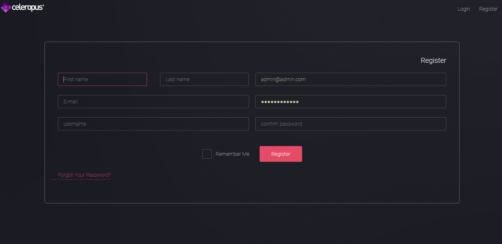
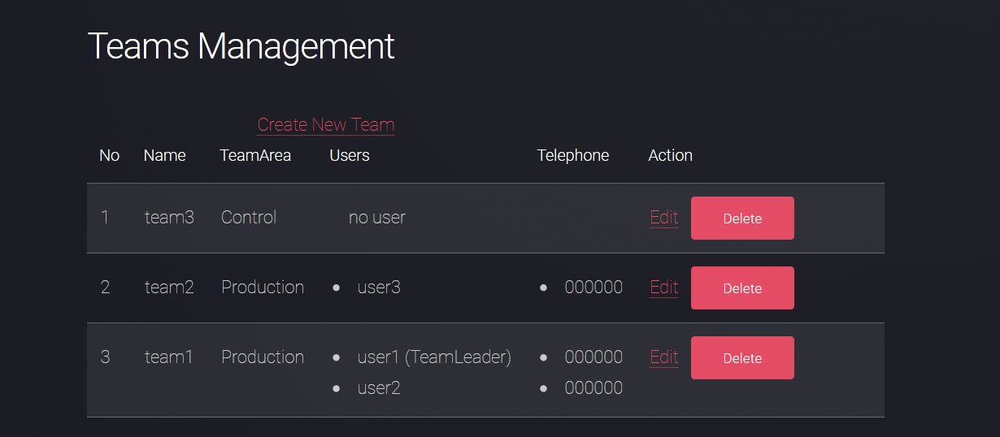
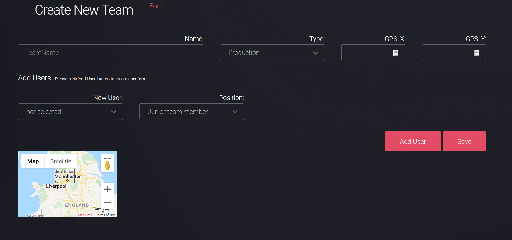
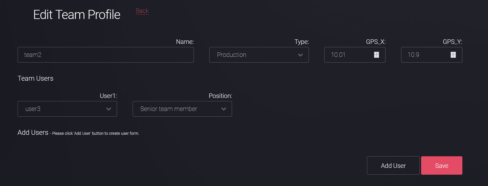
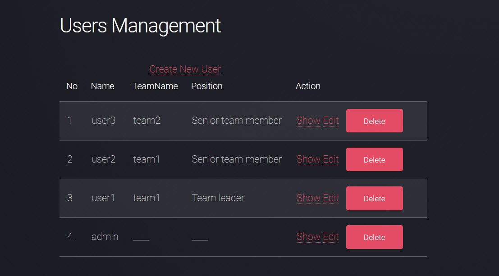
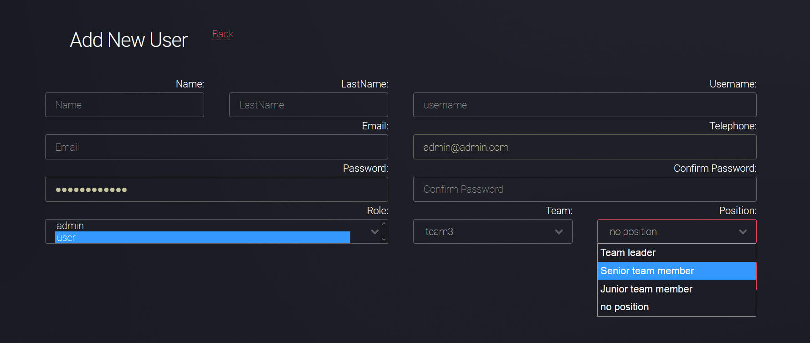

# ProjectManagementSystem

This project is based on laravel framework.
Admin has all privilege where as employee has certain restriction to access.By default You can register as an employee:
http://127.0.0.1:8000/register

## You can engage in this project to make this more advanced and you can add new features.You contribution will be highly appreciated !!

## Screenshots

### Login page

### Register page

### Team management - team list

### Team management - new team

### Team management - edit team

### User management - user list

### Team management - add employer

## Description
This project is for team & project management.
Employee can register himself and join to specific team.
Employer can assign new project to the team.

## Clone the repo
git clone https://github.com/cristian1201/Project-Management-Laravel.git

## Composer install
cd Project-Management-Laravel
composer install

# Migrate database and seed
Ajust the database information, then:

php artisan migrate --seed

# Login credentials
Admin Account: ['username' => 'admin', 'password' => 'admin']  

Employee Account: 
- ['username' => 'user1', 'password' => 'asdf']  
- ['username' => 'user2', 'password' => 'asdf']  
- ['username' => 'user3', 'password' => 'asdf']  

