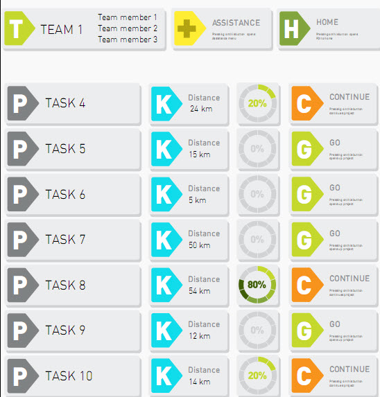
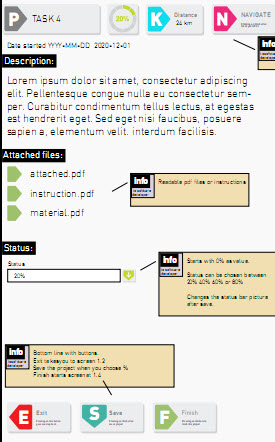
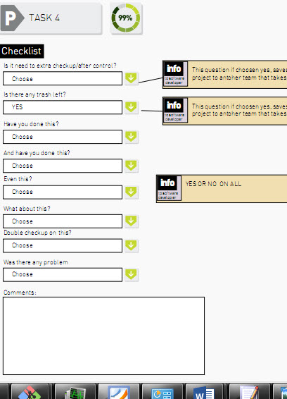
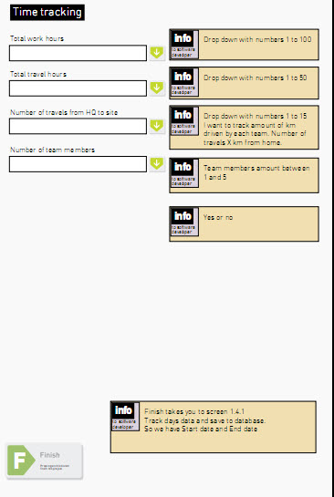
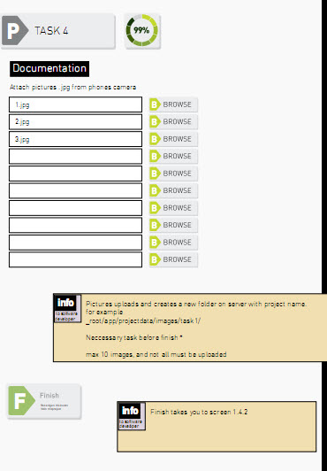
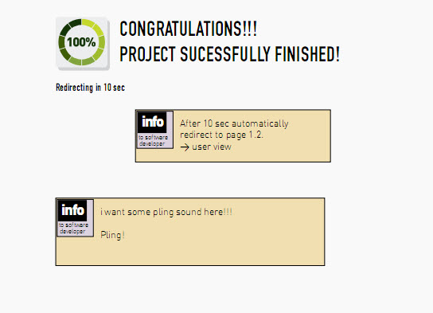

# Requirement

## 1.Models

Users, Teams, Tasks

- Users has the followings:
	* Fullname, username, password, Avatar, phoneNumber...
	* role(admin, user)
- Teams:
	* teamName
	* teamArea(production, trash, control)
- Tasks:
	* taskName
	* distance
	* percentage
	* attachment
	
***RelationShip***
- Users are belong to team. And have qualification
- Teams have many users and tasks.
- Tasks are belong to team.
	
## 2. Pages

Login and register pages.

The project include two part: The pages for users and admin.

### 2.1 Users 

There are 4 pages:

#### 2.1.1 TaskOverView (User's dashboard)

Here users can see the all tasks and use links in the site.

#### 2.1.2 TaskDetail ( when click the go or continue )

Here users can start or continue or finish the task:

- change % of finished part ( 20%, 40%, 60% 80% 100%) 
- upload picture documentation
- Upload Document attachments 

#### 2.1.3 CheckList ( when start the project )

This includes two pages.

- First: checkt the checklist

- Second: time tracking

- Third: documentation

And then congratulation page.

